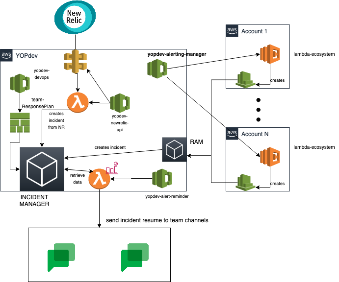
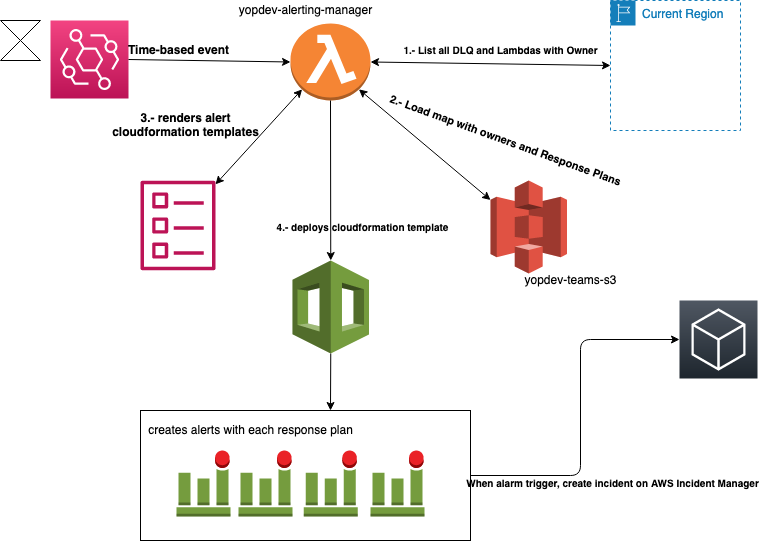

Alert Manager Lambda
==============================================================================

This lambda can detect all resources availables in AWS Account that it is deployed and create a Cloudformation template based in jinja to alert it to different Response Plans.

## Prerequisites (on your computer or build server):

 * Python 3.8
   * requirements.txt file
 * Git-remote-codecommit
 * PyTest
 * VirtualEnv (recommended)


## Getting started

Clone this project onto your hard drive:

    git clone 

Make whatever other changes are necessary, then push:

    git push origin master

## Project Diagram

Global project diagram



Lambda individual diagram



## Project layout

Source code for your lambda function is in the `api` directory.
Modules folder contains the resource modules with the alerting function for each module. To alert a different kind of resource, it's necessary to create a module named <resource>.py following the structure in the other modules and import it in `alerting` function and add to template as new lambda function.
Also here is the main code `alerting.py` and requirements file.

Jinja alerting templates are in `api/templates`.

`template.yml` contains SAM template to deploy it.

## Testing

Using pytest for testing [PyTest](https://docs.pytest.org/en/6.2.x/)

To run test, you must go to test folder and install requirements

```
pip install -r test_requirements.txt
```
and run

```
pytest
```

You must get a similar output:
```
========================================================================= test session starts ==========================================================================
platform darwin -- Python 3.9.1, pytest-6.2.4, py-1.10.0, pluggy-0.13.1
rootdir: /Users/username/path/to/yopdev-alerting-manager/test
collected 1 item                                                                                                                                                       

test_lambda.py .                                                                                                                                                 [100%]

========================================================================== 1 passed in 2.00s ===========================================================================
```

NOTE: Is strongly recommended to use a test **VirtualEnv**.


To test lambda local invoking, you need to use *template_local.yml* to build, because original template has New Relic Connections that Sam local can't handle.
